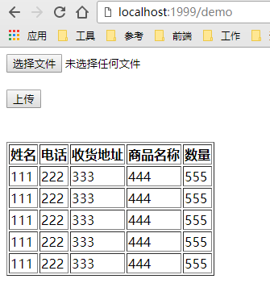

###Excel 文件上传和解析
---

- 用 Spring Boot + Gradle 搭建一个 Web 项目
- 新建一个页面
- 页面上放一个选择文件按钮 和 上传按钮
- 点击选择文件按钮后打开文件选择对话框，选择一个 Excel 文件
- 点击上传按钮后，上传此文件
- 服务端接收到此文件后，对 Excel 文件进行解析，读出 Excel 文件内容。
- 只需处理简单的 Excel 表格，不需考虑复杂格式。假定 Excel 中有 5 列，若干行，第一行是列标题。
- 将 Excel 文件中的数据以表格的形式显示在页面中

完成后的效果可参考下图:

